# 画面遷移図

ChordBook アプリケーションの画面遷移フローを説明します。

---

## 全体遷移図

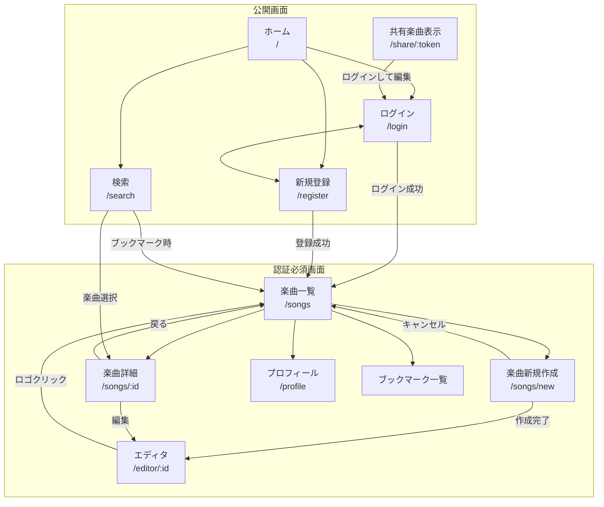

### 外部共有フロー

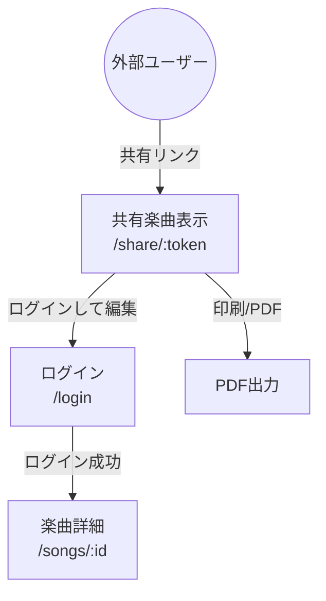

---

## 認証フロー

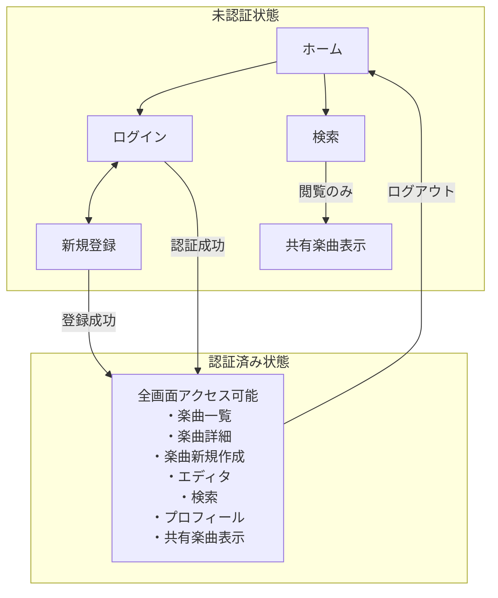

---

## 楽曲管理フロー

### 新規作成フロー

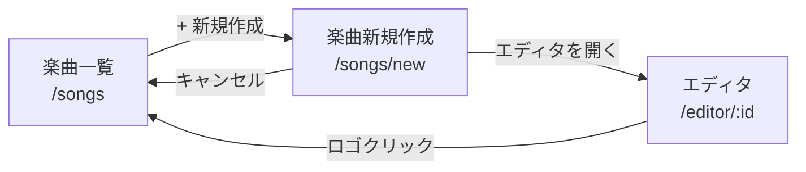

**詳細ステップ**

1. 楽曲一覧で「+ 新規作成」をクリック
2. 楽曲新規作成画面でメタ情報を入力
   - 曲名（必須）
   - アーティスト
   - キー
   - BPM
   - 拍子
3. 「エディタを開く」をクリック
4. 楽曲が作成され、エディタ画面へ遷移
5. セクション・コードを編集
6. 自動保存 or Ctrl+S で保存

### 編集フロー

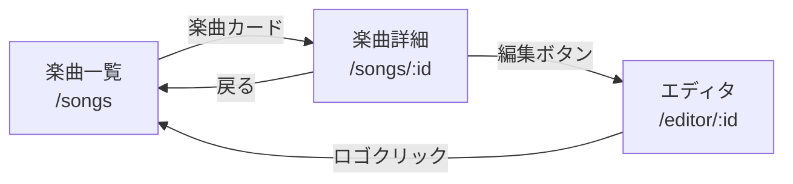

**詳細ステップ**

1. 楽曲一覧で楽曲カードをクリック
2. 楽曲詳細画面でコード譜を確認
3. 「編集」ボタンをクリック
4. エディタ画面でセクション・コードを編集
5. 自動保存 or Ctrl+S で保存
6. ロゴクリックで楽曲一覧に戻る

---

## 共有フロー

### 共有リンク生成

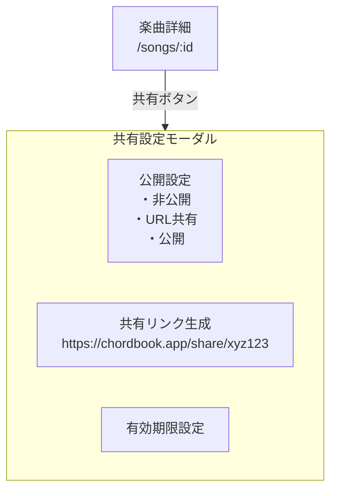

**共有設定オプション**

| 設定 | 説明 |
|------|------|
| 非公開 | 自分のみ閲覧可能 |
| URL共有 | リンクを知っている人が閲覧可能 |
| 公開 | 全ユーザーが検索・閲覧可能 |

### 共有リンクからのアクセス

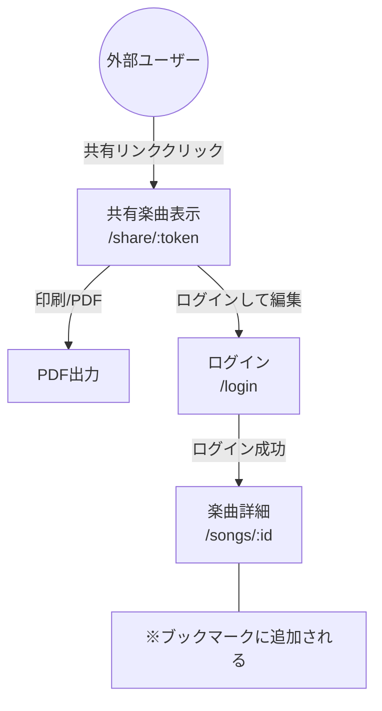

---

## 検索・ブックマークフロー

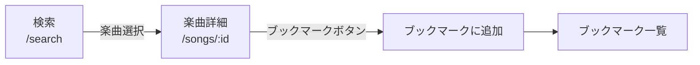

**詳細ステップ**

1. 検索画面でキーワードを入力
2. 検索結果から楽曲を選択
3. 楽曲詳細画面でコード譜を確認
4. 「ブックマーク」ボタンをクリック
5. マイブックマーク一覧に追加

---

## エディタ内部フロー

### セクション操作フロー

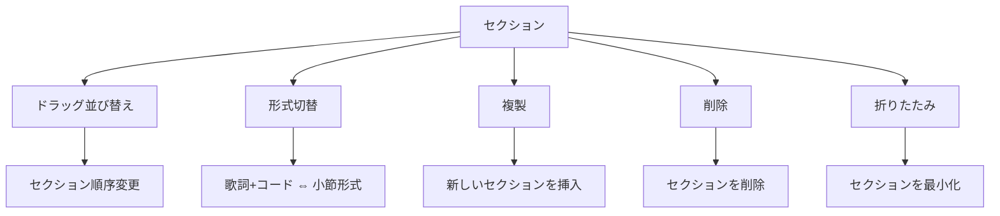

### コード入力フロー

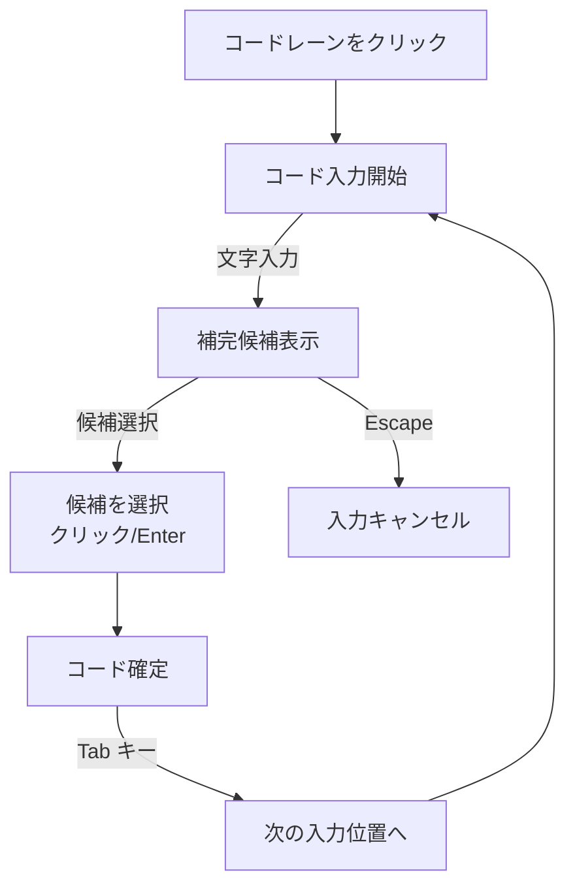

---

## 状態遷移（保存状態）

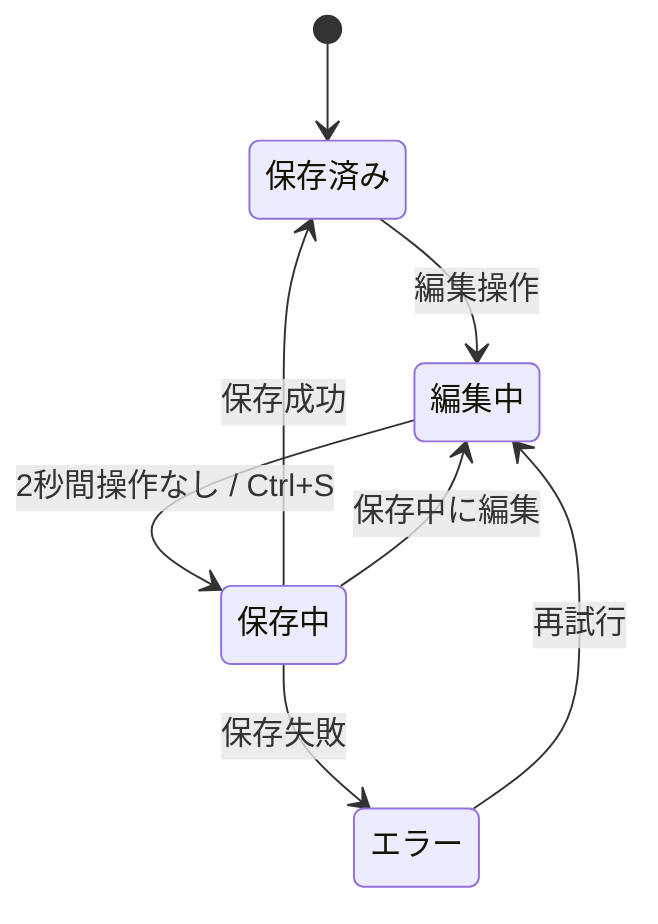

### 保存状態の説明

| 状態 | 表示 | 説明 |
|------|------|------|
| 保存済み | 「保存済み」| 変更がすべて保存されている |
| 編集中 | 「未保存の変更あり」| isDirty = true |
| 保存中 | 「保存中...」| API通信中 |
| エラー | エラーメッセージ | 保存に失敗、再試行可能 |

---

## ページアクセス権限マトリクス

| 画面 | 未認証 | 認証済み | 所有者 | 備考 |
|------|--------|---------|-------|------|
| ホーム `/` | ○ | ○ | - | ログイン済みはリダイレクト可 |
| ログイン `/login` | ○ | × | - | 認証済みは楽曲一覧へリダイレクト |
| 新規登録 `/register` | ○ | × | - | 認証済みは楽曲一覧へリダイレクト |
| 楽曲一覧 `/songs` | × | ○ | - | 要認証 |
| 楽曲詳細 `/songs/:id` | △ | ○ | ○ | 公開楽曲のみ未認証でも閲覧可 |
| 楽曲新規作成 `/songs/new` | × | ○ | - | 要認証 |
| エディタ `/editor/:id` | × | △ | ○ | 所有者のみ編集可 |
| 検索 `/search` | ○ | ○ | - | 公開楽曲の検索 |
| プロフィール `/profile` | × | ○ | - | 要認証 |
| 共有楽曲表示 `/share/:token` | ○ | ○ | - | 有効な共有リンクで閲覧可 |

**凡例**: ○ = アクセス可、× = アクセス不可（リダイレクト）、△ = 条件付き

---

## リダイレクトルール

```mermaid
flowchart LR
    subgraph リダイレクト条件
        A[未認証で認証必須ページ]
        B[認証済みでログイン画面]
        C[存在しない楽曲ID]
        D[無効な共有トークン]
        E[ログアウト実行]
    end

    A -->|リダイレクト| Login["/login?redirect=元のURL"]
    B -->|リダイレクト| Songs[/songs]
    C -->|リダイレクト + エラー| Songs2[/songs]
    D -->|リダイレクト + エラー| Home[/]
    E -->|リダイレクト| Home2[/]
```

| 条件 | 遷移元 | 遷移先 |
|------|--------|--------|
| 未認証で認証必須ページにアクセス | 任意 | `/login?redirect=元のURL` |
| 認証済みでログイン/登録画面にアクセス | `/login`, `/register` | `/songs` |
| 存在しない楽曲IDにアクセス | `/songs/:id`, `/editor/:id` | `/songs` + エラー表示 |
| 無効な共有トークン | `/share/:token` | `/` + エラー表示 |
| ログアウト実行 | 任意 | `/` |

---

## 関連ドキュメント

- [画面一覧](./screens.md) - 各画面の詳細仕様
- [機能一覧](../features/overview.md) - 機能詳細
- [フロントエンド設計](../architecture/frontend.md) - 技術実装
